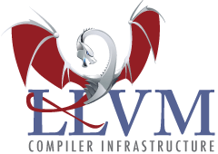

# LLVM Resources [↩](README.md#top)

<table style="font-family:Helvetica,Arial;line-height:1.6;">
  <tr>
  <td style="border:0;padding:0 10px 0 0;min-width:120px;"></td>
  <td style="border:0;padding:0;vertical-align:text-top;">This document gathers <a href="https://llvm.org/" rel="external">LLVM</a> related resources that caught our attention.
  </td>
  </tr>
</table>

## Articles

- [What is LLVM? The power behind Swift, Rust, Clang, and more][article_yegulalp] by Serdar Yeulalp, August 2023.
- [Remote LLVM development with Visual Studio Code][article_kleine] by Konrad Kleine, April 2021.
- [A Brief Introduction to Clang-Tidy][article_clang_tidy], by Bartlomeij Filipek, January 2021.
- [MIR: A lightweight JIT compiler project][article_mir], by Vladimir Makarov, January 2020.
- [A look at LLVM Advanced Data Types][article_data_types] by Serge Guelton, April 2019.
- [Compiler Performance and LLVM][article_compiler_perf] by Jonathan Goodwin, March 2019.
- [LLVM IR and Go][article_ir_go] by Robin Eklind, December 2018.
- [How LLVM optimizes a function](https://blog.regehr.org/archives/1603) by John Regehr, September 2018.
- [How LLVM optimizes power sums][article_power_sums] by Krister Walfridsson, April 2018.
- [Adventures in JIT compilation: Part 3 - LLVM](https://eli.thegreenplace.net/2017/adventures-in-jit-compilation-part-3-llvm/) by Eli Bendersky, May 2017.
- [Adventures in JIT compilation: Part 2 - an x64 JIT](https://eli.thegreenplace.net/2017/adventures-in-jit-compilation-part-2-an-x64-jit/) by Eli Bendersky, March 2017.
- [Adventures in JIT compilation: Part 1 - an interpreter](https://eli.thegreenplace.net/2017/adventures-in-jit-compilation-part-1-an-interpreter/) by Eli Bendersky, March 2017.
- [A Tourist’s Guide to the LLVM Source Code](https://blog.regehr.org/archives/1453) by John Regehr, January 2017.
- [LLVM for Grad Students](http://www.cs.cornell.edu/~asampson/blog/llvm.html) by Adrian Sampson, August 2015.
- [A deeper look into the LLVM code generator, Part 1](https://eli.thegreenplace.net/2013/02/25/a-deeper-look-into-the-llvm-code-generator-part-1) by Eli Bendersky, February 2013.
- [Life of an instruction in LLVM](https://eli.thegreenplace.net/2012/11/24/life-of-an-instruction-in-llvm) by Eli Bendersky, November 2012.
- [Create a working compiler with the LLVM framework, Part 2][article_sen_2] by Arpan Sen, June 2012.
- [Create a working compiler with the LLVM framework, Part 1][article_sen_1] by Arpan Sen, June 2012.
- [Writing Your Own Toy Compiler Using Flex, Bison and LLVM][article_toy_compiler], by Loren Segal, September 2009.

<!--
- [*Building an LLVM-based tool. Lessons learned*](https://lowlevelbits.org/building-an-llvm-based-tool.-lessons-learned/) by Alex Denisov, April 2019 ([EuroLLVM 2019](http://llvm.org/devmtg/2019-04/)).
-->

## Blogs

- [nikic's Blog](https://www.npopov.com/) :
  - [How to reduce LLVM crashes](https://www.npopov.com/2023/10/22/How-to-reduce-LLVM-crashes.html), October 2023.
  - [LLVM: The middle-end optimization pipeline](https://www.npopov.com/2023/04/07/LLVM-middle-end-pipeline.html), April 2023.
  - [This year in LLVM (2022)](https://www.npopov.com/2022/12/20/This-year-in-LLVM-2022.html), December 2022.
  - [Design issues in LLVM IR](https://www.npopov.com/2021/06/02/Design-issues-in-LLVM-IR.html), June 2021.
  - [Make LLVM fast again](https://www.npopov.com/2020/05/10/Make-LLVM-fast-again.html), May 2020.
- [LLVM Project Blog](https://blog.llvm.org/) :
  - [Improving LLVM Infrastructure - Part 1: Mailing lists][blog_llvm2022], January 2022.
  - [LLVM’s New Pass Manager][blog_llvm2021], March 2021.
- [LLVM Infrastructure and Rust][blog_modebadze] by Beka Modebadze, December 2021.
- [Compiling With Clang Optimization Flags][blog_exterman] by Dori Exterman, August 2021.
- [Building llvm-project with Ninja on MacOS][blog_guo] by Yilong Guo (Intel), May 2021.
- [Code alignment options in LLVM](https://easyperf.net/blog/2018/01/25/Code_alignment_options_in_llvm) by Denis Bakhvalov, January 2018.

## Books [**&#x25B4;**](#top)

- [Learn LLVM 17][book_nacke_2nd] (2nd Edition) by Kai Nacke, January 2024. (Packt, ISBN 978-1-83763-134-6, 416 pages)
- [Advanced Compiler Design with LLVM][book_chisnall] by David Chisnall, March 2022. (Pearson, ISBN  978-0-1337-9864-7, 360 pages)
- [LLVM Techniques, Tips and Best Practices][book_hsu] by Min-Yih Hsu, April 2021. (Packt Publishing, ISBN 978-1-8388-2495-2, 370 pages)
- [Tutorial: Creating an LLVM Backend for the Cpu0 Architecture][book_cpu0] by Chen Chung-Shu, February 2020 (*Release 3.9.1*).
- [Mapping High Level Constructs to LVVM IR](https://mapping-high-level-constructs-to-llvm-ir.readthedocs.io/en/latest/) (*ebook*) by Michael Rodle, 2018.
- [LLVM Essentials][book_sarda] by S. Sarda &amp; M. Pandey, December 2015 (Packt Publishing, ISBN 978-1-78528-080-1, 166 pages).
- [LLVM Cookbook][book_pandey], by M. Pandey &amp; S. Sarda, May 2015. (Packt Publishing, ISBN 978-1-78528-598-1, 296 pages)
- [Getting Started with LLVM Core Libraries][book_lopez] by B. Cardoso Lopez &amp; R. Auler, August 2014. (Packt Publishing, ISBN 978-1-78216-692-4, 314 pages)
<!--
- [Learn LLVM 12][book_nacke] by Kai Nacke, May 2021. (Packt Publishing, ISBN 978-1-8392-1350-2, 392 pages)
-->

## Courses

- [Introduction to the Low-Level Virtual Machine (LLVM)](https://www.youtube.com/playlist?list=PLDSTpI7ZVmVnvqtebWnnI8YeB8bJoGOyv), October 2021.
- [CS 6120: Advanced Compilers: The Self-Guided Online Course](https://www.cs.cornell.edu/courses/cs6120/2020fa/self-guided/) by Adrian Sampson, 2020.
- [DCC888: Static Program Analysis](https://homepages.dcc.ufmg.br/~fernando/classes/dcc888/) by Fernando Pereira, January 2020.
- [Compilers](https://anoopsarkar.github.io/compilers-class/index.html): [*Code Generation with LLVM](https://anoopsarkar.github.io/compilers-class/llvm-practice.html) by [Anoop Sarkar](https://www2.cs.sfu.ca/~anoop/) (instructor), Summer 2019.
- [EEECS 582: Advanced Compilers](http://web.eecs.umich.edu/~mahlke/courses/583f18/), Fall 2018.
- [Advanced compilers][course_hirvisalo] by Vesa Hirvisalo (instructor), 2015.

## News [**&#x25B4;**](#top)

- [*LLVM Weekly*][news_llvmweekly] - A weekly newsletter covering developments in LLVM, Clang, and related projects.
- [*Planet Clang*][news_planet_clang] - Planet Clang is a window into the world, work and lives of Clang developers, contributors and the standards they implement.

<!--
- [LLVM Archive](https://www.linux-magazin.de/tag/llvm/) - Linux-Magazin.
-->

## Papers

- [Alive2: Bounded Translation Validation for LLVM](https://www.cs.utah.edu/~regehr/#pubs) by Nuno P. Lopes, PLDI 2021, Jun 2021.

> **Note:** See page <a href="https://llvm.org/pubs/"><i>"LLVM Related Publications"</i></a> on the official <a href="https://llvm.org/" rel="external">LLVM</a> website.
> 
> We mention here only publications from <a href="http://nondot.org/~sabre/" rel="external">Chris Lattner</a>'s and <a href="https://vikram.cs.illinois.edu/">Vikram Adve</a>:
>
> - <a href="http://aosabook.org/en/llvm.html"><i>Design decisions that shapped LLVM</i></a> by Chris Lattner (March 2012).
> - <a href="https://llvm.org/pubs/2002-08-09-LLVMCompilationStrategy.pdf"><i>The LLVM Instruction Set and Compilation Strategy</i></a> by Chris Lattner and Vikram Adve (August 2002).
> - <a href="http://llvm.org/pubs/2002-12-LattnerMSThesis.html" rel="external"><i>LLVM: An infrastructure for Multi-Stage Optimization</i></a> by Chris Lattner (Master Thesis, December 2002).

## Tools

<!--
- [pacman/Tips and tricks](https://wiki.archlinux.org/index.php/Pacman/Tips_and_trick]) from [Arch Linux](https://archlinux.org/), January 2021.
-->
- [Compiler Explorer][tools_godbolt] (type your C/C++ code in the left pane, then select "*x86-64 clang 13.0.1*" and add a new pane "*IR output*").
- [Polly](https://polly.llvm.org/) &ndash; a high-level loop and data-locality optimizer and optimization infrastructure for LLVM.
- [Utilizing TableGen for Non-Compiling Processes](https://www.embecosm.com/2015/04/14/utilizing-tablegen-for-non-compiling-processes/) by Simon Cook, April 2015.
- [LLVM TableGen](https://wiki.aalto.fi/display/t1065450/LLVM+TableGen) by Sami Teräväinen, February 2015.

<!--
## Footnotes

<a name="footnote_01">[1]</a> ***Visual Studio Locator*** [↩](#anchor_01)

-->

***

*[mics](https://lampwww.epfl.ch/~michelou/)/June 2024* [**&#9650;**](#top)
&nbsp;

<!-- link refs -->

[article_clang_tidy]: https://blog.wholetomato.com/2021/01/08/a-brief-introduction-to-clang-tidy-and-its-role-in-visual-assist/
[article_compiler_perf]: http://pling.jondgoodwin.com/post/compiler-performance/
[article_data_types]: https://developers.redhat.com/blog/2019/04/01/a-look-at-llvm-advanced-data-types-and-trivially-copyable-types/
[article_ir_go]: https://blog.gopheracademy.com/advent-2018/llvm-ir-and-go/
[article_kleine]: https://developers.redhat.com/blog/2021/04/22/remote-llvm-development-with-visual-studio-code#
[article_mir]: https://developers.redhat.com/blog/2020/01/20/mir-a-lightweight-jit-compiler-project/
[article_power_sums]: https://kristerw.blogspot.com/2019/04/how-llvm-optimizes-geometric-sums.html
[article_sen_1]: https://www.ibm.com/developerworks/library/os-createcompilerllvm1/index.html
[article_sen_2]: https://www.ibm.com/developerworks/library/os-createcompilerllvm2/index.html
[article_toy_compiler]: https://gnuu.org/2009/09/18/writing-your-own-toy-compiler/
[article_yegulalp]: https://www.infoworld.com/article/3247799/what-is-llvm-the-power-behind-swift-rust-clang-and-more.html
[blog_exterman]: https://www.incredibuild.com/blog/compiling-with-clang-optimization-flags
[blog_guo]: https://blog.nuullll.com/2021/05/15/building-llvm-project-with-ninja-on-macos.html
[blog_llvm2021]: https://blog.llvm.org/posts/2021-03-26-the-new-pass-manager/
[blog_llvm2022]: https://blog.llvm.org/posts/2022-01-07-moving-to-discourse/
[blog_modebadze]: https://www.bexxmodd.com/log/llvm-infrastrucutre-and-rust/7
[book_chisnall]: https://www.amazon.com/Advanced-Compiler-Pearson-Software-Development/dp/013379864X
[book_cpu0]: https://jonathan2251.github.io/lbd/llvmstructure.html
[book_hsu]: https://www.packtpub.com/product/llvm-techniques-tips-and-best-practices-clang-and-middle-end-libraries/9781838824952
[book_lopez]: https://www.packtpub.com/application-development/getting-started-llvm-core-libraries
[book_nacke]: https://www.packtpub.com/product/learn-llvm-12/978183921350
[book_nacke_2nd]: https://www.packtpub.com/product/learn-llvm-17-second-edition/9781837631346
[book_pandey]: https://www.packtpub.com/application-development/llvm-cookbook
[book_sarda]: https://www.packtpub.com/application-development/llvm-essentials
[course_hirvisalo]: https://wiki.aalto.fi/display/t1065450/Advanced+compilers+2015
[news_llvmweekly]: http://llvmweekly.org/ "LLVM Weekly"
[news_planet_clang]: http://planet.clang.org/ "Planet Clang"
[tools_godbolt]: https://www.godbolt.org/
